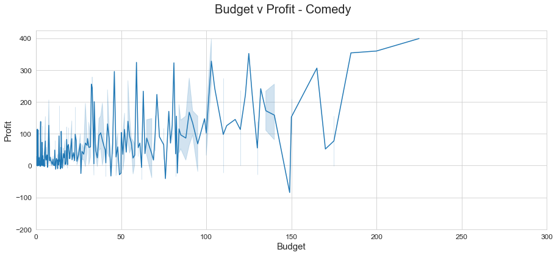
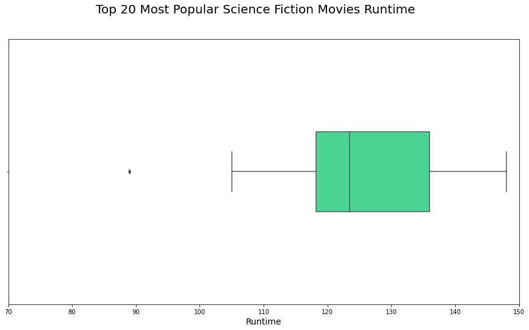

# Movie Analysis
#### Joe Swing, Kamryn Bendolph, Jacob Hoogstra

## Overview

This project took a deep dive into the world of movies, analyzing large amounts information from tons of popular websites for movie reviews, like Rotten Tomatoes and TMDB. Our client, Microsoft, is looking to venture into the realm of movie production and our job is to analyze data in a way that helps them make a smart business decision. While cleaning and looking through all the data we had, it became important to define what a good or successful movie is. Using things like budget, revenue, profit, and popularity, we determined what a good movie suggestion would be for three levels of risk.  

## Business Problem

Microsoft is opening a movie studio in response to competition's creation of video content. However, they are not well voiced in the realm of movie production so it is our job to analyze our data and create a suggestion for which genre of movie they should make. We used a variety of analyses to determine what the most important factors in movie success are. It is important to take into consideration how much the director is willing to spend and what level of risk they want to take. We wanted to answer the question of, "What attributes make a movie successful?". We went through the data and compared the movies we deemed successful, and compared their attributes to those of the movies that did not do well. By doing that analysis, we were able to come up with a metric that we can use to determine the success of a movie.

## Data Understanding

To compile our analysis, we used data collected from a couple of data frames that were given to us and from some that we found online. We used a TMDB data frame from kaggle.com that had information on over 10,000 movies that were made up to the year 2017. The datasets included characteristics of different movies like runtime, budgets, revenue, and critic & consumer ratings. We deemed these characteristics to be the most important when evaluating the success of a film. Although the datasets included a lot of information on a ton of different movies, some of the datasets were limited in that they had null values and/or placeholders in place for characteristics that were not recorded for older movies.  

## Data Preparation

As we started to compile of our data and examine it, we realized that there was a lot more data than we needed to make our analysis. We decided to clean our data and get rid of the columns and rows that contained null values and placeholders and just columns with information that we just did not need. We also created columns that compared data from different columns to get a better sense of the data we were working with. For example, we created a profit column that took the difference between a movie's budget and its revenue. In the movie industry, there are movies in each genre that either did unusually well like Avatar or were unusually bad. These movies were outliers in our data sets that skewed our data so we created a line of code that calculated the z score and got rid of any movies that were 2 or more standard deviations away from the mean. Getting rid of the outliers was important because as a new movie producer, Microsoft does not necessarily need to aim to create record breaking, blockbuster films like Jurassic World and Star Wars in order to be successful. 

## Results

As our analysis started to come to an end, we came up with a range of options for Microsoft to choose from based on their budget and how much risk they are willing to take. These ranges were based on the size of the average size budget that is needed for each genre to be successful. Based on our analysis, in the low risk range, Comedy and Romance were the genres of movies that had the best success and greater chance to generate a successfull movie. In the medium risk range, Action and Sci Fi were the genres that used a medium size budget and had a good chance of success. If Microsoft wanted to go all out and make a big investment, they can create an Animation film that would have a high risk, but a greater chance of a huge payout in the end. 

### Vote Average

### Vote Count

### Revenue  and Budget

### Budget v Profit 





### Runtime





## Conclusions

We recommend that Microsoft stakeholders evaluate their budget for the movie and select a genre based on the risk level that it requires for it to be a successful movie. As they look at their budget, they can use our suggestions to pick a genre to focus their movie production on. Our analysis focuses on each specific genre, but we do realize that some movies utilize aspects from multiple genres and uses them together. In the future we could analyze what combination of genres makes the most successful movie instead of focusing on each one in its singularity.

## For More Information

Please review our full analysis in

For any additional questions, please contact **Kamryn Bendolph at krbendol@bsc.edu, Joe Swing at jcswing@bsc.edu, & Jacob Hoogstra at hoogstraj@gmail.com**

## Repository Structure

```
├── README.md                           <- The top-level README for reviewers of this project
├── cleaning_of_data.ipynb   <- Narrative documentation of analysis in Jupyter notebook
├── DS_Project_Presentation.pdf         <- PDF version of project presentation
├── data                                <- Both sourced externally and generated from code
└── images                              <- Both sourced externally and generated from code
```